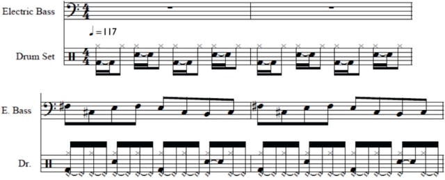
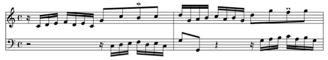
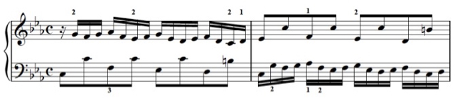

# Humanizing music

To humanize your music, see our plugins on maxforlive.com for the professional audio software Live by Ableton AG:
* [Group Humanizer](http://www.maxforlive.com/library/device/2466/group-humanizer), >16,000 downloads
* [Humanizer](http://www.maxforlive.com/library/device/2144/humanizer), >9,500 downloads

These plugins are the most popular plugins for the Software Live of the last 5 years (in terms of downloads) and are used by professional musicians worldwide.
Below are some examples to get a feel for what humanized music sounds like (these were not made with Ableton's Live).
For inquiries, please contact Dr. Holger Hennig or James Holden.

## 1) Musical coupling: "group humanize" music

### Audio example: Michael Jackson's Billie Jean

*   Group-Humanizing: Bass and drum are communicating as if two musicians played in the same room, their interbeat intervals are long-range cross-corr\elated (standard deviation 10 ms).
See file in downloads/group_humanizing/mp3/AudioExample1_MusicalCoupling_BillieJean.mp3

*   Humanizing: Bass and drum are not communicating, as if two musicians were recorded playing in separate rooms (standard deviation 10 ms).
See file in downloads/group_humanizing/mp3/AudioExample2_Humanizing_BillieJean.mp3

*   Randomizing: Uncorrelated (white noise) deviations are added to the beats of drum and bass who are not communicating, as currently implemented in professional audio software (standard deviation 10 ms).
See file in downloads/group_humanizing/mp3/AudioExample3_Randomizing_BillieJean.mp3

## 2) Humanize music

Is 1/f humanizing as good as a real human musician? Certainly not... The 1/f humanizing can only cover generic fluctuations that every musician produces, but all other artistic articulations (e.g. intentional deviations) are not considered.

The musical pieces below are humanized with different strength. For the same musical piece, the higher the standard deviation s of the added fluctuations given in milliseconds, the stronger the humanizing.

### J.S. Bach, Invention no.1 in C major, BWV 772

*   1/f humanizing (standard deviation s=11 ms).
See file in downloads/bach_invention1/mp3/invention1_a1_s11.mp3

*   white noise humanizing (s=11 ms).
See file in downloads/bach_invention1/mp3/invention1_a0_s11.mp3

*   exact. See file in downloads/bach_invention1/mp3/invention1_e.mp3

### J.S. Bach, Prelude no. 2 in C minor (Well-tempered Clavier Vol. II, BWV 871)

In this piece the first part shall be repeated once, note that due to the fluctuations added while humanizing, each line is unique, i.e. the repetition is not an exact repetition of the first part in case of the humanized pieces.

*   1/f humanizing (s=10.5 ms).
See file in downloads/bach_prelude2/mp3/prelude2_a1_s10.5.mp3

*   white noise humanizing (s=10.5 ms).
See file in downloads/bach_prelude2/mp3/prelude2_a0_s10.5.mp3

*   exact. See file in downloads/bach_prelude2/mp3/prelude2_e.mp3

### Pop song "Everyday, everynight"

This song, created and humanized in collaboration with Cubeaudio recording studio (Göttingen, Germany), also shows the two different humanizing techniques (focus on the rhythm to hear the difference).
See file in downloads/Audioexample_1f_vs_WN.mp3

First, sample A, then sample B is played, separated by a 5 sec. pause. The two samples differ only in the rhythmic structure, all other properties such as pitch and timbre are identical.The first part (sample A) of this audio example was humanized by introducing LRC (using Gaussian 1/f-noise), while for sample B the conventional humanizing technique using Gaussian white noise was applied. The standard deviation σ_{1/f} = σ_{WN} = 15 ms of the time series of deviations used for humanizing was chosen rather large for the purpose of demonstration. The song was created and humanized in collaboration with Cubeaudio recording studio (Göttingen, Germany). We observed a clear preference for the 1/f humanizing over the white noise humanized version in our study.

Here is the whole 1/f humanized song "Everyday, everynight" (with a smaller standard deviation s):

*   1/f humanizing (s=7.5 ms).
See file in downloads/popsong/Everyday_a1s7.5.mp3

*   1/f humanizing (Instrumental version, s=7.5 ms).
See file in downloads/popsong/Everyday_instr_a1s7.5.mp3

### Bonus tracks

*   Invention no.1 by J.S. Bach: In this variation, I have replaced the piano sounds of the left hand by drum sounds. The whole piece is slightly 1/f humanized (s=10 ms).
See file in downloads/bach_invention1/bonus_tracks/invention1_drum_a1_s10.mp3
